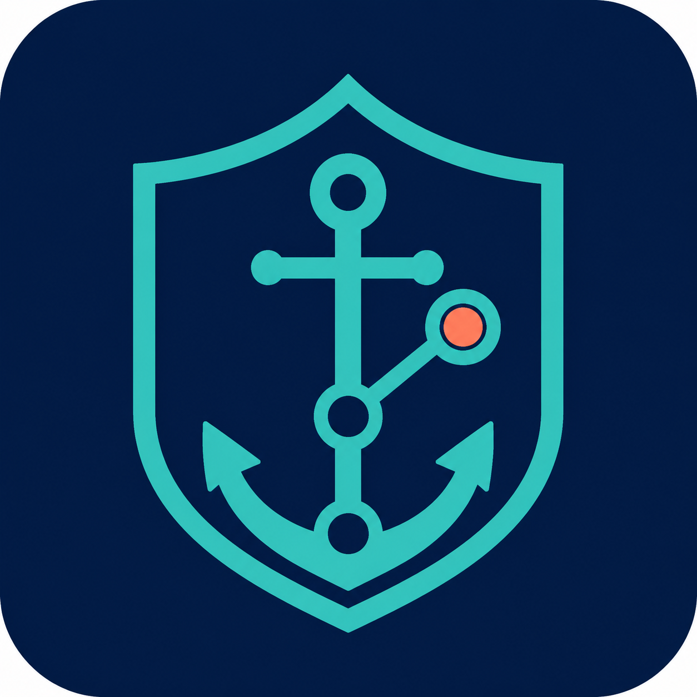

<p align="center">
  
</p>

<h1 align="center">GitHarbor</h1>

<p align="center"><strong>Your self-hosted safe harbor for Git repositories.</strong></p>

<p align="center">
  <a href="docs/wiki/Getting-Started.md">Documentation</a> ·
  <a href="https://github.com/xChaooticz/GitHarbor/wiki">Wiki</a> ·
  <a href="LICENSE">MIT License</a> ·
  <a href="CHANGELOG.md">Changelog</a> ·
  <a href="CONTRIBUTING.md">Contributing</a>
</p>

GitHarbor continuously discovers repositories owned and starred by one GitHub account, loads
explicit Forgejo and GitLab repositories from an optional file, and mirrors their Git data into
Gitea. All sources support LFS and native release metadata; populated GitHub wikis and explicitly
configured external wiki Git repositories are mirrored separately. GitHub and Forgejo also support
safe release-asset transfers. GitHub-owned sources can additionally preserve linked container
packages. Its
defining rule is preservation: a repository that vanishes, becomes inaccessible, is transferred,
or is unstarred remains in Gitea. GitHarbor records the change in state and never automatically
deletes a destination repository.

## Features

- Bare Git mirrors preserve branches, tags, history, notes, and other ordinary refs; provider-owned
  pull refs are an explicit opt-in because they can number in the hundreds of thousands
- Persistent validated source caches with incremental fetch, automatic recovery, garbage collection,
  and stale-entry expiry
- Optional versioned TOML inventory for explicit Forgejo and GitLab repositories
- Authenticated Git LFS object preservation across all mirrored refs
- Native Gitea wiki mirrors with complete source history and empty-wiki detection
- Native Gitea release metadata and streamed release-asset mirroring with size-limit safeguards
- Opt-in multi-platform container mirroring for packages linked to owned repositories, with
  all-image or latest-image retention
- Stable provider/source identities for rename and transfer tracking
- Source repository descriptions copied into Gitea with clear mirror provenance
- Collision-proof starred naming and guarded Gitea ownership markers
- Independent, paginated owned/starred discovery with transient API retries and rate-limit reporting
- SQLite state with WAL mode and versioned Alembic migrations
- Six-hour scheduler by default, startup sync, manual global sync, and repository retry
- Configurable bounded repository concurrency plus global and per-repository synchronization locks
- Responsive FastAPI/Jinja dashboard, filtering, detail pages, history, and a small REST API
- Structured JSON logs with credential redaction
- Non-root, health-checked, single-container Docker deployment

## Architecture

GitHarbor is one Python process. FastAPI serves the UI/API, an asyncio scheduler invokes the
reconciliation service, HTTPX clients speak to the source providers and Gitea, and SQLAlchemy stores
inventory and run history in SQLite. Each repository has a persistent bare-mirror cache: the first
run clones it, later runs fetch only changes, and the resulting refs and reachable LFS objects are
pushed to Gitea. There are no working trees. Populated GitHub wikis and explicitly configured
external wikis are mirrored separately into Gitea's native wiki repositories. Releases and their
assets are reconciled after the Git push through provider and Gitea APIs. Owned-repository container
packages are discovered through the GitHub Packages API and copied registry-to-registry with Skopeo
when enabled.

See [Architecture decisions](docs/architecture.md) for identity, naming, safety, and failure rules.

## Quick start with Docker Compose

New to GitHarbor? The complete [Getting started guide](docs/wiki/Getting-Started.md) explains Docker
networking, source and Gitea tokens, destination organizations, Git LFS, external repositories,
first-run verification, and security.

```sh
cp .env.example .env
# Edit .env with tokens, usernames, namespaces, and the Gitea URL.
docker compose up -d
docker compose logs -f githarbor
```

This pulls `ghcr.io/xchaooticz/githarbor:latest`. To build the image locally from the checked-out
source instead, use:

```sh
docker compose up -d --build
```

Set `GITHARBOR_IMAGE_TAG=v0.7.3` in `.env` to pin a specific published release. If the GitHarbor
package itself is private, log the Docker host in before Compose tries to pull it:

```sh
docker login ghcr.io -u YOUR_GITHUB_USERNAME
```

Paste the same classic PAT configured as `GITHUB_TOKEN` when Docker prompts for a password. The
token needs `read:packages` and access to the package. Repository and package visibility are
separate GitHub settings, so a private repository does not by itself prove that login is required.

Open `http://DOCKER_HOST_IP:9005` from any device on the same private network. Compose maps host
port `9005` to the container's internal port `8000` and listens on all host interfaces by default.
Set `GITHARBOR_BIND_ADDRESS=127.0.0.1` when only the Docker host or a local reverse proxy should
reach it. GitHarbor has no built-in user authentication, so never expose this port directly to an
untrusted network or the internet.

The named volume `githarbor-data` contains SQLite state and the persistent bare-mirror cache. Gitea
itself stores the preserved destination data. Back up both the Gitea installation and this volume;
the cache is reconstructable, but retaining it avoids downloading every source history again.

## Updating GitHarbor

Subscribe to **Watch → Custom → Releases** on the
[GitHub repository](https://github.com/xChaooticz/GitHarbor) to be notified about new versions. The
installed version is returned by `http://DOCKER_HOST_IP:9005/api/health` and shown in the API docs.
Before upgrading, read the [changelog](CHANGELOG.md) and back up GitHarbor's volume and Gitea.

If the deployment was cloned from this repository, update its tracked Compose and documentation
files first. The ignored `.env` file is retained:

```sh
git fetch --tags
git checkout v0.7.3
```

When `GITHARBOR_IMAGE_TAG` is pinned, change it in `.env` to the same new release tag. With `latest`,
no tag edit is needed, but Docker still needs an explicit pull. Then recreate and verify the service:

```sh
docker compose pull githarbor
docker compose up -d --no-deps --wait --wait-timeout 180 githarbor
docker compose logs --tail 100 githarbor
curl --fail http://127.0.0.1:9005/api/health
```

See [Operations: Upgrade GitHarbor](docs/wiki/Operations.md#upgrade-githarbor) for backup guidance,
source-built deployments, database migrations, and post-upgrade checks.

## Credentials and permissions

### GitHub

`GITHUB_TOKEN` is one classic GitHub PAT used for API discovery, Git/LFS, releases, assets, optional
container packages, and private GHCR login. Grant the standard `repo` and `read:packages` scopes.
They cover private repository data, container images, repository metadata, and the authenticated
account's stars; classic PATs do not expose separate Metadata, Contents, or Starring read switches.
`GITHUB_USERNAME` must equal the token's account. GitHarbor never writes to GitHub and does not need
`read:user`, `write:packages`, or `delete:packages`.

See [Tokens and permissions](docs/wiki/Tokens-and-Permissions.md) for click-by-click creation steps,
required scopes, enterprise notes, and rotation instructions.

Organization SSO restrictions still apply. A GitHub `404` can mean deletion, lost access, or an SSO
authorization problem; GitHarbor therefore treats absence as state, never as permission to delete.

### External Forgejo and GitLab sources

Public external repositories normally need no token. A private entry uses `token_env` to name a
read-only environment variable; the token itself stays in `.env`, never in TOML or a URL. It must
allow provider API metadata/release reads and HTTPS Git/LFS/wiki reads. GitLab commonly uses
`read_api` and `read_repository`; Forgejo permissions vary by server version. See
[External sources](docs/wiki/External-Sources.md) for setup and provider limitations.

### Gitea

Create an API token for a dedicated Gitea account. It needs repository read/write access, permission
to create repositories in all configured organizations (or in its own user namespace), and Git
push access. With scoped-token Gitea versions and organization destinations, grant `read:user`,
`write:organization`, and `write:repository`. Add `write:package` when container packages are
enabled. A personal-user destination needs `write:user` instead of `read:user`. GitHarbor verifies
`/api/v1/user` and accepts a destination namespace only when it is
an organization accessible to the token or the authenticated user's own namespace. The
[Gitea organizations guide](docs/wiki/Gitea-Organizations.md) covers the two GitHub destinations and
the recommended optional external-source organization.

Within GitHarbor, tokens stay in environment memory. They are not persisted to SQLite, HTML, API
output, Git config, or command arguments. Git authentication uses a temporary askpass helper whose
token comes from a child-process environment. A separate `docker login` stores the same GitHub PAT
in the Docker host's configured credential store when a private deployment image must be pulled.

## Configuration

| Variable | Required/default | Meaning |
|---|---:|---|
| `GITHARBOR_IMAGE_TAG` | `latest` | Published container tag selected by Compose |
| `GITHARBOR_BIND_ADDRESS` | `0.0.0.0` | Dashboard host address; use `127.0.0.1` for host-only access |
| `GITHARBOR_PORT` | `9005` | Dashboard port published by Compose |
| `GITHUB_TOKEN` | required | Classic GitHub PAT with `repo` and `read:packages` |
| `GITHUB_USERNAME` | required | Login owning the token and owned repository set |
| `GITHUB_API_URL` | `https://api.github.com` | GitHub API base (also supports GHES) |
| `GITEA_URL` | required | Gitea root URL, without `/api/v1` |
| `GITEA_TOKEN` | required | Gitea API/Git token |
| `GITEA_OWNED_NAMESPACE` | required | Gitea user or organization for owned repositories |
| `GITEA_STARRED_NAMESPACE` | required | Gitea user or organization for starred repositories |
| `SYNC_INTERVAL` | `6h` | Positive seconds or `s`, `m`, `h`, `d` duration |
| `SYNC_ON_STARTUP` | `true` | Run discovery and synchronization after startup |
| `SYNC_CONCURRENCY` | `3` | Repositories mirrored concurrently during a global run (`1`–`32`) |
| `DATABASE_PATH` | `/data/githarbor.db` | Persistent SQLite path |
| `DESTINATION_PRIVATE` | `true` | Create new Gitea destinations as private |
| `API_TIMEOUT_SECONDS` | `30` | Per-request API timeout |
| `WIKI_ENABLED` | `true` | Mirror populated GitHub and explicitly configured external wikis |
| `RELEASES_ENABLED` | `true` | Mirror supported source-provider release metadata |
| `RELEASE_ASSETS_ENABLED` | `true` | Mirror assets when release mirroring is enabled |
| `RELEASE_ASSET_MODE` | `all` | Asset retention: `all` releases or only `latest` stable release |
| `RELEASE_ASSET_TIMEOUT_SECONDS` | `3600` | Per release-asset download or upload timeout |
| `PACKAGES_ENABLED` | `false` | Mirror container packages linked to owned GitHub repositories |
| `GITHUB_CONTAINER_REGISTRY` | `ghcr.io` | Source container registry host |
| `CONTAINER_IMAGE_MODE` | `all` | Container retention: every digest or the literal `latest` digest |
| `PACKAGE_MAX_BYTES` | `0` | Conservative per-image size ceiling; `0` disables it |
| `PACKAGE_TRANSFER_TIMEOUT_SECONDS` | `3600` | Per Skopeo registry operation timeout |
| `GIT_LFS_ENABLED` | `true` | Fetch and upload LFS objects before publishing Git refs |
| `GIT_PULL_REFS_ENABLED` | `false` | Preserve provider-owned `refs/pull/*` commits under a safe namespace |
| `GIT_TIMEOUT_SECONDS` | `3600` | Clone, fetch, or push timeout per command |
| `GIT_CACHE_PATH` | `/data/git-mirrors` | Persistent bare-mirror cache used for incremental Git and LFS fetches |
| `GIT_CACHE_RETENTION_DAYS` | `30` | Retain cache entries absent from discovery; `0` removes them immediately |
| `EXTERNAL_SOURCES_FILE` | unset | Read-only TOML inventory for Forgejo and GitLab repositories |
| `ADMIN_ACTIONS_ENABLED` | `false` | Enable guarded stop-sync and bulk organization-reset dashboard controls |
| `ADMIN_ACTIONS_TOKEN` | required when admin actions are enabled | Separate token required for every admin action; never use `GITEA_TOKEN` |
| `LOG_LEVEL` | `INFO` | JSON log threshold |

Settings are validated on startup. Secrets have no defaults. Existing Gitea repositories are never
made public/private or otherwise reconfigured automatically.

## Repository organization and preservation

Owned repository `github-user/my-project` becomes
`GITEA_OWNED_NAMESPACE/my-project`. A starred repository becomes
`GITEA_STARRED_NAMESPACE/github-owner--repository`. The owner prevents human ambiguity. GitHarbor
adds the stable-ID suffix `--gh123456` only when normalization or an existing destination causes a
real collision. Existing legacy names are shortened automatically when the clean destination is
available; assignments remain fixed across later upstream renames and transfers.

Each Gitea description starts with the source repository's description and ends with readable mirror
provenance plus a management marker containing its provider, stable ID, and repository kind.
Description changes are copied on the next sync. Before every push, an existing destination must
have the exact expected marker; a missing or mismatched marker stops the operation rather than
overwriting an unrelated repository.

Successful discovery updates records by provider, stable source ID, and kind. Missing owned or
external repositories become `unavailable`; missing starred repositories become `unstarred`.
Neither transition calls a Gitea delete API. Reappearing IDs become active and resume
synchronization. An individual sync error marks only that record `error`; the rest of a global run
continues.

## Forgejo and GitLab sources

Set `EXTERNAL_SOURCES_FILE=/config/external-sources.toml` and mount a file based on
[`external-sources.example.toml`](external-sources.example.toml) into the container:

```toml
version = 1

[[repositories]]
provider = "forgejo"
clone_url = "https://git.eden-emu.dev/eden-emu/eden.git"
wiki_url = "https://git.eden-emu.dev/eden-emu/eden.wiki.git"
destination_namespace = "external-backups"
```

GitHarbor asks the provider API for the stable repository ID, name, description, and default branch.
The example above therefore becomes destination `external-backups/eden`, using Forgejo repository ID
`2` namespaced to `git.eden-emu.dev`; neither value needs to be copied into the file. An optional
explicit `id` remains available as a backward-compatible identity override; the provider metadata
API is still required. Once assigned, the identity and destination are retained. `clone_url` and
`wiki_url` must be HTTP(S) Git URLs without
embedded credentials. `wiki_url` is optional: when omitted, GitHarbor performs no wiki lookup or
wiki synchronization for that entry.

For a private source, set `token_env = "EDEN_FORGEJO_TOKEN"` in TOML and provide that variable to
the container separately. GitLab defaults the Git username to `oauth2`; Forgejo defaults it to
`git`. Override `git_username` only when the source instance requires another value. Authenticated
source URLs must use HTTPS.

External sources preserve Git refs, history, notes, tags, and reachable LFS objects. A configured
wiki preserves its separate Git history and attachments. Native release metadata is mirrored through
the provider API by default; Forgejo release attachments with a declared size are copied too. GitLab
release asset links do not provide a trustworthy byte size, so they produce a durable skip warning
instead of bypassing Gitea's attachment safeguards. Set `releases = false` or
`release_assets = false` on an entry when desired. GitHub container-package discovery remains
limited to owned GitHub repositories.

The full field reference, private-token configuration, namespace guidance, and verification steps
are in [External sources](docs/wiki/External-Sources.md).

## Git semantics and LFS

GitHarbor creates a persistent bare cache for each source repository. Later synchronizations run
`git fetch --prune` into that cache before `git push --mirror`, so only new Git objects need to be
fetched and uploaded. The cache is stored under `GIT_CACHE_PATH` (on the default Docker `/data`
volume). It can be discarded while GitHarbor is stopped; the next synchronization recreates it.
This cache is validated before reuse and automatically rebuilt if it is invalid or corrupt. Active
caches receive `git gc --auto`, and entries absent from successful discovery expire after
`GIT_CACHE_RETENTION_DAYS`. GitHarbor processes up to `SYNC_CONCURRENCY` repositories at once. This
preserves ordinary Git objects and refs, including force pushes and upstream ref deletions.
GitHarbor retries a destination push after
transient HTTP gateway failures such as 502, 503, or 504; a retry is safe because the mirror push is
idempotent. Deleting an upstream branch or tag therefore also deletes that ref from the
GitHarbor-managed destination; deleting the destination repository itself never happens
automatically.

Provider-owned `refs/pull/*` refs are excluded by default. Large GitHub projects can expose more
than 100,000 of these internal refs, making otherwise ordinary destination pushes impractical. Set
`GIT_PULL_REFS_ENABLED=true` to retain their PR-only commits under
`refs/githarbor/github-pull/*`; actual pull-request metadata is not migrated in either mode.
Gerrit-style `refs/for/*` refs always move to `refs/githarbor/gerrit-for/*` because Gitea interprets
the source namespace as pull-request creation commands. After each ref push, GitHarbor sets Gitea's
default branch to the source provider's current default branch.

Every Git clone, fetch, LFS operation, ref preparation, destination push, and cache-GC step logs its
start, completion status, and duration at `LOG_LEVEL=INFO`. A timeout or cancellation terminates the
entire Git process group so HTTP helpers cannot leave a synchronization stuck.

With `GIT_LFS_ENABLED=true` (the default), GitHarbor runs authenticated `git lfs fetch --all` against
the source and `git lfs push --all` against a named destination remote before it publishes Git refs.
The HTTP LFS URLs are pinned to the API-provided clone URLs rather than accepting a repository-owned
`.lfsconfig` redirect. If any LFS step fails, the refs are not pushed and that repository is marked
`error`. Set `GIT_LFS_ENABLED=false` only when pointer-only mirroring is intentional.

Gitea must have its LFS server enabled (`LFS_START_SERVER = true`). GitHarbor preserves LFS objects
reachable from mirrored refs; LFS locks and already-orphaned server objects are outside the Git
history and are not copied.

## Wiki mirroring

For GitHub, GitHarbor reads the repository-level wiki capability flag on every discovery or
individual sync. Disabled wikis are skipped without another network operation. External sources are
checked only when their separate `wiki_url` is explicitly configured; omission skips the wiki
without guessing or probing a URL. An enabled but never-created or otherwise empty wiki is skipped.

When pages exist, GitHarbor enables the native wiki unit on the managed Gitea destination and uses a
bare mirror push to preserve every wiki commit and ref. Like the primary Git mirror, this makes the
source wiki authoritative: an upstream force-update or ref deletion is reflected in Gitea. Wiki
attachments committed into the wiki repository are ordinary Git objects and are
preserved. A configured wiki clone or push failure marks the repository and run `error` after the
primary repository has been preserved, so the incomplete optional layer is visible and retryable.
Set `WIKI_ENABLED=false` to skip wiki checks and updates. Existing Gitea wiki data is retained.

## Release and release-asset mirroring

After the Git refs (including release tags) are current, GitHarbor lists releases through the
GitHub, Forgejo, or GitLab API and creates or updates native Gitea releases. It preserves the tag,
title, Markdown body, target commitish, draft state, and prerelease state. A hidden marker appended
to the Gitea release body records the source release ID and managed asset IDs without changing the
visible source text. GitHarbor refuses to overwrite an existing same-tag Gitea release that lacks
this ownership marker. Already-correct releases are left unchanged, avoiding unnecessary Gitea
PATCH requests, and attachment data returned with the release list is reused.

`RELEASES_ENABLED=false` skips both release metadata and assets without deleting existing Gitea
releases. With releases enabled, `RELEASE_ASSETS_ENABLED=false` continues updating release metadata
but leaves all existing attachments untouched.

Assets are downloaded and uploaded one at a time through an isolated temporary file. GitHarbor
checks the downloaded byte count and verifies a source SHA-256 digest when one is available. It asks
Gitea's attachment-settings API for the advertised per-file maximum and skips an oversized asset
before downloading it. Attachments disabled by Gitea, source assets that are not fully uploaded,
HTTP `413` responses, reverse-proxy or storage rejections, and individual transfer failures are also
skipped without failing the Git or release-metadata mirror.

Every skipped asset is written to the repository's persistent **Last warning**, and that repository
run is marked `partial`; the repository itself remains `active` and later syncs retry the asset. A
release-metadata API rejection is handled the same way, and its Gitea validation message is shown in
the warning. A reverse proxy can enforce a smaller request limit than Gitea advertises, so a
successful proactive check cannot guarantee the upload will be accepted. Adjust
`RELEASE_ASSET_TIMEOUT_SECONDS` for slow large transfers.

`RELEASE_ASSET_MODE=all` mirrors assets for every visible release. `latest` still mirrors metadata
for every visible release but retains assets only on the source provider's latest published stable
release. Drafts and prereleases are not candidates. When the latest release changes, GitHarbor
uploads its assets and deletes assets it previously managed
from older releases. If any new-latest asset fails, older assets are retained until a later retry
succeeds. Switching back to `all` restores eligible older assets on the next sync.

For safety, GitHarbor deletes a stale managed asset only when its recorded Gitea ID, name, and size
still match. Externally changed assets are retained with a warning, and releases absent from the
current source response are retained. Gitea authorship and creation timestamps, source asset labels,
and download counts cannot be recreated through the target API. Forgejo attachments require a
declared size and safe same-origin URL; GitLab links without a trustworthy size are skipped with a
durable warning.

## Container package mirroring

Set `PACKAGES_ENABLED=true` to mirror GitHub Container Registry packages explicitly linked to an
owned repository. Packages associated only with starred repositories are not copied. This boundary
avoids silently archiving third-party images and may be expanded in a future release behind a
separate opt-in policy.

`CONTAINER_IMAGE_MODE=all` copies every discovered manifest and all of its tags. GitHarbor also adds
a `githarbor-preserved-sha256-...` tag per digest so a mutable source tag moving later cannot make an
older digest unreachable. `latest` means the literal case-insensitive `latest` tag—not the newest
timestamp. It copies that digest plus every other source tag attached to the same digest, such as
`1.4` and `1.4.0`. If no literal `latest` exists, GitHarbor warns and keeps the previous destination
image rather than guessing.

Multi-platform manifest lists and their referenced images are copied with preserved digests. A new
latest image is fully copied and verified before GitHarbor removes older tags and digests recorded
as its own. Unmanaged or externally changed Gitea tags are never deleted. Gitea does not advertise
its container-package size limit through a standard settings API, so `PACKAGE_MAX_BYTES` provides a
conservative preflight estimate. Gitea, storage, or reverse-proxy rejection is recorded in **Last
warning**, marks the run partial, and leaves the previous latest image intact.

See [Container packages](docs/wiki/Container-Packages.md) for setup, permissions, path mapping,
retention details, and verification commands.

## API

- `GET /api/health`
- `GET /api/status`
- `GET /api/repositories?kind=starred&status=error&issue=warning&search=owner`
- `GET /api/repositories/{id}`
- `POST /api/sync`
- `POST /api/repositories/{id}/sync`

Mutation endpoints return `202`; overlapping requests return `409`. OpenAPI documentation is at
`/docs`. The API never serializes tokens or clone URLs.

## Local development

```sh
python -m venv .venv
. .venv/bin/activate             # Windows: .venv\Scripts\activate
pip install -e ".[dev]"
cp .env.example .env
alembic upgrade head
uvicorn githarbor.app:app --reload
```

Verification:

```sh
pytest
ruff check .
ruff format --check .
mypy githarbor
docker build -t githarbor:local .
docker compose config
```

Most tests use temporary SQLite databases and mocked clients. The suite also performs a real,
token-free Git LFS transfer between temporary local bare repositories; `git-lfs` is therefore
required for local testing and is installed in the Docker test stage. A separately marked CI test
provisions disposable Forgejo and Gitea services and verifies an idempotent external mirror of Git
refs, a wiki, release metadata, and a release asset through the real provider APIs.

GitHub Actions also starts the complete Compose service, checks the public health endpoint, and
blocks merges or releases when Trivy finds a fixable high or critical vulnerability in the image.
The container check runs weekly as well, so newly disclosed vulnerabilities are caught even when
the source has not changed. Publishing a release copies that tag's `docs/wiki` snapshot to the
GitHub Wiki after the container workflow starts. Third-party actions are pinned to immutable commits,
and both Python dependencies and actions are monitored by Dependabot.

## Troubleshooting

See the full [Troubleshooting guide](docs/wiki/Troubleshooting.md) for provider permissions,
container networking, namespace errors, LFS failures, scheduling, and safe issue reports.

- **GitHub username mismatch:** the token account and `GITHUB_USERNAME` must match. This prevents a
  public-only endpoint from silently omitting private owned repositories.
- **Destination marker refusal:** GitHarbor found a repository at the desired Gitea path but cannot
  prove it manages that repository. Move/rename the unrelated repository; do not forge markers.
- **Repository remains unavailable/unstarred:** this is expected preservation behavior. Restore
  source access, restore the star, or re-add the external entry; the next complete discovery uses
  the stable ID and resumes.
- **Private clone fails after API discovery:** ensure the classic GitHub PAT has `repo`, can access
  that repository, and has any required organization SSO authorization.
- **SQLite cannot open:** ensure the container's UID 10001 can write the mounted `/data` directory.
- **Large repository timeout:** raise `GIT_TIMEOUT_SECONDS` and check cache-disk capacity. The first
  run downloads all configured refs; later runs normally fetch only changes.
- **LFS upload fails:** verify Gitea has `LFS_START_SERVER = true`, the token can write the repository,
  and its LFS storage has enough free space. Git refs are intentionally withheld on LFS failure.
- **Release asset is skipped:** inspect **Last warning** on the repository page. Compare the asset
  size with Gitea's attachment limit and any reverse-proxy body-size limit, then retry the sync.
- **Container image is skipped:** inspect **Last warning**, verify the GitHub token has
  `read:packages`, verify registry reachability, then compare Gitea's package and reverse-proxy
  limits with `PACKAGE_MAX_BYTES`.

## Current limitations

- One GitHub identity and one application replica per SQLite database
- No built-in login/RBAC; use an authenticated reverse proxy
- No issue, pull request, Actions, discussion, LFS-lock, or orphaned-LFS-object migration
- Container packages are limited to packages linked to owned repositories; starred-repository
  package mirroring may be added as a separate opt-in mode in a future release
- Release authorship/timestamps, asset labels/download counts, and deleted source releases are not
  reproduced; GitHarbor preserves the last managed release instead
- GitLab release links without a trustworthy byte size are reported and skipped; external container
  packages are not mirrored
- In-process locks do not coordinate multiple GitHarbor containers; run one replica
- Destination repository visibility is applied only at creation

GitHarbor is licensed under the [MIT License](LICENSE).
